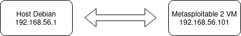
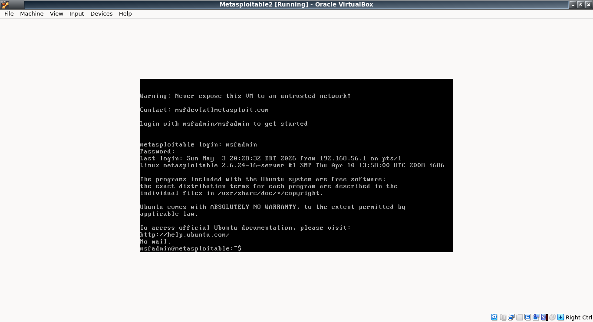
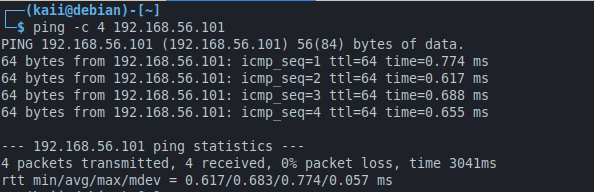

# Panduan Setup Lab Keamanan Lokal

**Tanggal:** 4 Mei 2026  
**Tujuan:** Membangun lingkungan uji coba aman untuk latihan penetration testing antara Debian sebagai penyerang dan Metasploitable 2 sebagai target.

---

## Spesifikasi Perangkat
- **Laptop:** Asus X454YA, Ram 4, AMD A8-7410
- **Host OS:** Debian 13.4
- **Virtualisasi:** VirtualBox 7.2.8r173730

---

## Mesin Virtual Target: Metasploitable 2
- **Sistem Operasi:** Ubuntu 8.04
- **RAM yang dialokasikan:** 512 MB
- **Jaringan:** Host-Only Adapter (`vboxnet0`)

---

## Diagram Jaringan 




## Langkah Instalasi

### 1. Install virtualbox

```
sudo apt update && sudo apt install virtualbox-7.2 -y
```

### 2. Unduh dan Impor Metasploitable 2

```
wget https://downloads.sourceforge.net/project/metasploitable/Metasploitable2/metasploitable-linux-2.0.0.zip
```
lalu ekstrak.

### 3. Buat VM

```
VBoxManage createvm --name "Metasploitable2" --ostype Ubuntu_64 --register

VBoxManage modifyvm "Metasploitable2" --memory 512 --cpus 1 --nic1 hostonly --hostonlyadapter1 vboxnet0

VBoxManage storagectl "Metasploitable2" --name "IDE Controller" --add ide

VBoxManage storageattach "Metasploitable2" --storagectl "IDE Controller" --port 0 --device 0 --type hdd --medium "Downloads/Metasploitable2-Linux/Metasploitable.vmdk"
```

### 4. Buat Host-Only Network

```
VBoxManage hostonlyif create
sudo ip addr add 192.168.56.1/24 dev vboxnet0
sudo ip link set vboxnet0 up
```

### 5. Buka dan login Metaslpoit2 di vm

jalankan perintah ini untuk membuka vm:

```
VBoxManage startvm "Metaslpoitable2" 
```

login menggunakan `msfadmin`



### 5. Konfigurasi IP Statis pada Metasploitable 2

```
sudo ifconfig eth0 192.168.56.101 netmask 255.255.255.0 up
```


jika ingin permanen:


```
sudo nano /etc/rc.local
```

Tambahkan baris berikut sebelum `exit 0`:

```
/sbin/ifconfig eth0 192.168.56.101 netmask 255.255.255.0 up
```

Simpan, lalu:

```
sudo chmod +x /etc/rc.local
sudo reboot
```


### 6. Menjalankan Metasploit2 dengan ssh (opsional)

untuk mematikan virtual box: 

```
VBoxManage controlvm "Metasploitable2" poweroff 
```

menjalankan virtualbox tanpa gui:

```
VBoxManage startvm "Metaslpoitable2" --type headless
```

lalu masuk dengan ssh -rsa:

```
ssh -o HostKeyAlgorithms=ssh-rsa -o PubkeyAcceptedKeyTypes=ssh-rsa msfadmin@192.168.56.101
```

### 7. Uji Konektivitas


```
ping 192.168.56.101
```

jika muncul koneksi latensi maka berhasil.




