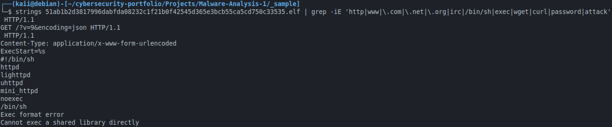
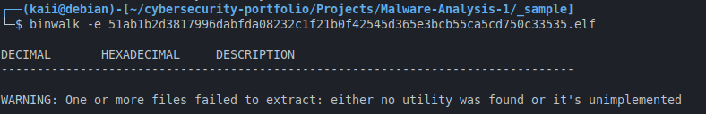
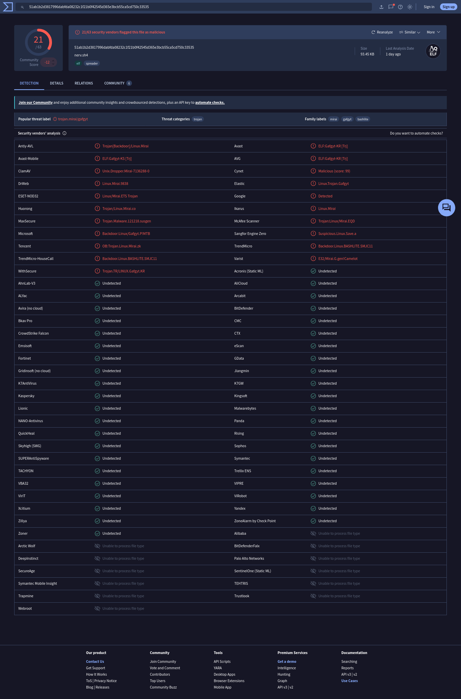

# Laporan Analisis Malware Statis

**Tanggal Analisis:** 10 Mei 2026  
**Sumber Sampel:** MalwareBazaar  
**Hash MD5:** 03f197b52e1483cff72ed9e02790ed17
**Hash SHA256:** 51ab1b2d3817996dabfda08232c1f21b0f42545d365e3bcb55ca5cd750c33535
**Tipe File:** ELF 32-bit (Linux executable)

---

## Ringkasan
Sebuah sampel malware diduga varian **Mirai** yang menargetkan perangkat berbasis Linux. Analisis statis mengungkap beberapa Indikator Kompromi (IOC) termasuk server C2, kredensial bawaan, dan mekanisme propagasi.

---

## Metodologi
- Analisis dilakukan secara statis (file tidak dijalankan).
- Alat: `file`, `strings`, `md5sum`, `binwalk`, `VirusTotal`.
- Lingkungan: Debian host.

---

## Temuan

### Identifikasi File
`file` melaporkan: *ELF 32-bit LSB executable, ARM, version 1 (SYSV), statically linked, stripped*

### Hash
- **MD5:** `03f197b52e1483cff72ed9e02790ed17`  
- **SHA256:** `51ab1b2d3817996dabfda08232c1f21b0f42545d365e3bcb55ca5cd750c33535`

### String Signifikan
Ditemukan string mencurigakan:
```
/bin/sh
#!/bin/sh
Exec format error
Cannot exec a shared library directly
```



### Analisis Binwalk



`binwalk` tidak menemukan data tersembunyi.

### Deteksi VirusTotal



## Indikator Kompromi (IOC)


| Jenis IOC                | Nilai                                                               |
| ------------------------ | ------------------------------------------------------------------- |
| **SHA-256**              | `51ab1b2d3817996dadbfda08232c1f21b0f42545d365e3bcb55ca5cd750c33535` |
| **SHA-256** (bundled)    | `be1578f469623266ff523763da1fc918f2a8cdc4a7be50c4ba86fb024cfad40`   |
| **MD5**                  | `03f197b52e1483cff72ed9e02790ed17`                                  |
| **SHA-1**                | `d67346a97e1b66b296d4301cb7e1bc4298c54743`                          |
| **Nama file**            | `nerv.sh4`, `antivirus-gratuit-anti-hacking.elf`                    |
| **Ukuran file**          | `95692 bytes`                                                       |
| **Arsitektur**           | `Renesas SH` (ELF32)                                                |
| **Segment .text offset** | `224`                                                               |
| **First Seen**           | `2026-05-08 23:02:12 UTC`                                           |

## Kesimpulan

Berdasarkan hasil analisis VirusTotal, sampel file ELF dengan SHA-256 `51ab1b2d3817996dadbfda08232c1f21b0f42545d365e3bcb55ca5cd750c33535` merupakan varian dari malware Mirai/Gafgyt yang ditargetkan untuk arsitektur Renesas SH (banyak digunakan pada perangkat embedded dan router). File ini bersifat statically linked dan stripped, menandakan tidak ada kode dependensi eksternal. Dari 63 vendor keamanan, 21 di antaranya mendeteksinya sebagai malicious. Malware ini kemungkinan digunakan untuk merekrut perangkat IoT ke dalam botnet guna melancarkan serangan DDoS atau aktivitas jahat lainnya.

## Rekomendasi

- Blokir IOC di perimeter firewall.
- Perbarui firmware perangkat IoT secara berkala.
- Ganti kredensial default.